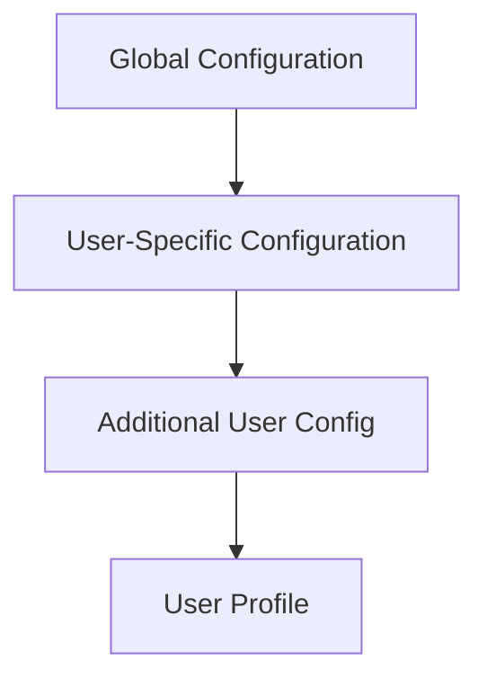
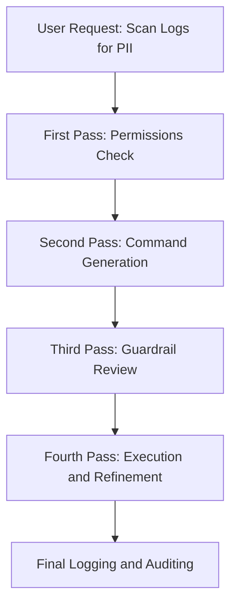
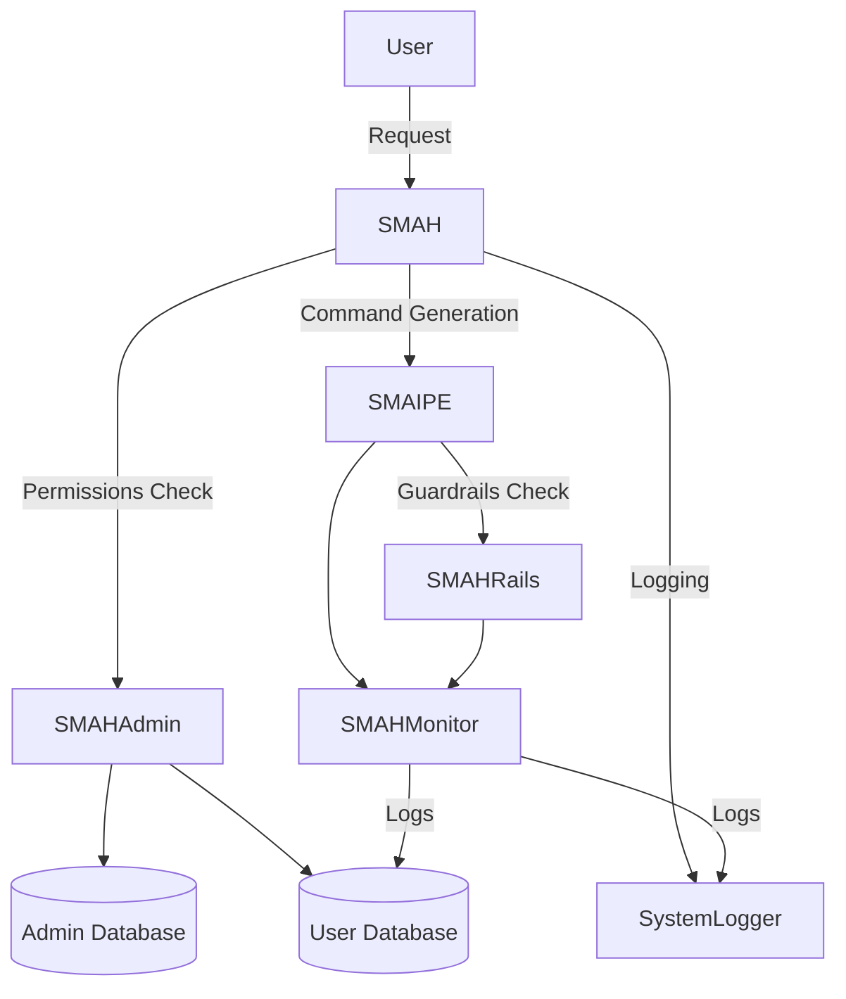

# SMAH Architecture Overview 

VERY ROUGH GENASSISTED DRAFT

## 1. Introduction

SMAH (Smart as Hell) is a command-line tool that provides system-tailored advice, interactive help, and command completion using natural language processing. It is packaged using `poetry` for deployment on multiple systems. This document outlines the architecture, focusing on configuration management, security, data management, logging, and the multi-pass prompt validation system for secure and compliant command execution.

---

## 2. Configuration Management

SMAH uses a hierarchical configuration system that ensures flexibility and user-specific customization. Configurations can be defined at both the global and user levels, with overrides and additions possible under user directories.

### Configuration Files

- **Global Configuration**:  
  - Default: `/etc/smah/system-config.yaml`  
  - Can be overridden with `SMAH_SYSTEM_CONFIG` environment variable.
  
- **User Configuration**:  
  - Primary: `~/.smah/system-config.yaml`
  - Additional: `~/.smah/user-system-config.yaml`

Other configurations include:
- **Default User Profile**: Defines system-wide user expectations.
  - Global: `/etc/smah/default-user-profile.yaml`
  - User-specific: `~/.smah/default-user-profile.yaml`
  
- **User Profile**: Overrides default profile for specific users.
  - Location: `~/.smah/user-profile.yaml`

- **Guardrails Configuration**: Set to restrict and monitor disallowed or dangerous actions based on the user's role and the system environment.
  - Global: `/etc/smah/system-smah-guardrails.yaml`
  - User-specific: `~/.smah/system-smah-guardrails.yaml`

### Configuration Load Order

1. Global system configuration (`/etc/smah/` or set by `SMAH_SYSTEM_CONFIG`).
2. User-specific configuration (`~/.smah/system-config.yaml`).
3. Additional user-level configurations (`~/.smah/user-system-config.yaml`).
4. User profile (`~/.smah/user-profile.yaml`).

### Diagram: Configuration Flow



---

## 3. Security

### User Permissions and Execution

- SMAH runs as the current user by default unless explicitly configured to run with elevated privileges.
- If executed as root, it operates as a **smah-agent** unless explicitly configured to run as root by the system admin.
- Role-Based Access Control (RBAC) is used to restrict what users can do based on their assigned roles.

### Guardrails and User Escalation

- **SMAHRails** enforces restrictions to prevent unauthorized actions.
- De-escalation logic ensures users with too many permissions are limited unless approved by a superuser.

### Security Logging

- All sensitive operations, permission escalations, and guardrail breaches are logged for review by system administrators.
  
---

## 4. Data and Database Management

SMAH leverages PostgreSQL databases with TimescaleDB extensions for managing user and system configurations.

### Database Structure

- **smah_admin**: Global administrative database.
- **uuid4(user.guid)_sma_user**: Each user has a unique user-specific database.
  
### Role Assignments

- **sma_user**: Limited read permissions for user-specific data.
- **Admin Roles**: Assigned for advanced access to system-level or sensitive operations.

### Multi-Tenant Prefixing

To support multi-tenant setups, SMAH allows the use of prefixes in database naming conventions (e.g., `PREFIX_smah_admin`) to separate environments.

---

## 5. Multi-Pass Prompt Processing

SMAH uses a **multi-pass prompt validation system** to ensure that any AI-driven command generation is secure, compliant, and non-malicious. Here’s how the process works, particularly when scanning logs for sensitive data:

### Pass 1: User Permissions Validation

- **Goal**: Verify that the user is authorized to perform sensitive actions.
- **Outcome**: If the user lacks sufficient permissions, the system halts or requests superuser approval.

### Pass 2: Command Generation

- **Goal**: Construct a prompt that instructs the LLM (language model) how to perform the user’s requested action.
- **Example**: Instructing **SMAIPE** to scan logs for sensitive user data such as PII.
  
### Pass 3: Guardrail Review and Prompt Validation

- **Goal**: Verify that the generated prompt is secure and complies with system policies.
- **Outcome**: If the prompt passes this check, it is approved for execution. If not, the process halts, or the prompt is refined.

### Pass 4: Execution and Refinement

- **Goal**: Test the command, and if the output is insufficient, refine the process until it meets expectations.

### Pass 5: Final Logging and Auditing

- **Goal**: Log the entire process, including intermediate prompts, results, and decisions, for post-execution review.

### Diagram: Multi-Pass Prompt Processing



---

## 6. Logging and Monitoring

SMAH’s logging system captures all command executions and validation steps for auditability and compliance.

- **SMAHMonitor**: Logs all commands, generated prompts, and user actions.
- **Retention Policies**: Logs are periodically rotated, and retention policies are implemented to avoid excessive disk usage.

Centralized logging is planned for future multi-tenant setups to collect logs from distributed systems.

---

## 7. Inference and Prompt Handling

SMAH uses AI-driven prompts to assist users, but all prompts must pass through rigorous checks before execution.

- **Sanity Checks**: Each generated prompt is validated to ensure it aligns with system rules.
- **Fallback Mechanisms**: If a prompt fails, a fallback is generated to handle the request safely.

### Prompt Configuration

1. Local configuration in `~/.smah` is checked first.
2. User-specific database is queried next.
3. As a last resort, the **smah_admin** database is queried, but only if the user has the required roles.

---

## 8. Secrets Management

SMAH securely stores secrets (e.g., API keys) and accesses them in the following order:
1. **Local Configuration**: `~/.smah`.
2. **User-Specific Database**: Queried for user-specific secrets.
3. **Admin Database**: Only accessed if the user has proper roles.

Regular rotation policies are recommended to keep secrets fresh and secure.

---

## 9. Future Enhancements

- **Enhanced Security**: Further development of security features will focus on stronger root command restrictions, API security, and guardrail enforcement.
- **Degraded Support**: Basic functionality will be available for environments that do not support TimescaleDB.
- **Multi-Tenant Management**: Centralized multi-tenant configurations will be developed for larger enterprise use cases.

---

## 10. Conclusion

SMAH is designed to provide flexible, AI-driven command-line assistance with a focus on security, compliance, and auditability. The multi-pass prompt processing system ensures that all actions are checked and reviewed before execution, providing a robust and safe user experience.

This architecture will evolve as we build out more advanced features and integrate with larger multi-tenant and distributed environments.

---

## 11. System Components Diagram

Here is a diagram showing how SMAH components like **smah**, **smahadmin**, **smaipe**, **smahmonitor**, **smahrdrails**, **databases**, and **system logger** work together:



- **SMAH**: The main interface for handling user requests.
- **SMAHAdmin**: Manages admin configurations, databases, and permissions.
- **SMAIPE**: Executes user commands and processes data.
- **SMAHRails**: Enforces guardrails to ensure compliance with system policies.
- **SMAHMonitor**: Logs all actions and processes for auditing.
- **System Logger**: Stores logs and provides a historical record.
- **Admin Database**: Stores global configuration and user roles.
- **User Database**: Stores user-specific data and configurations.
``````
